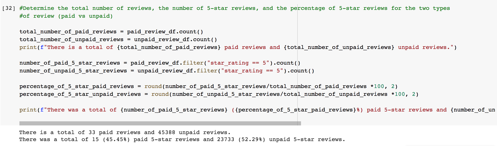

# Amazon_Vine_Analysis

## Overview of Project

Analyze Amazon reviews written by members of the Amazon Vine program to determine if there is any bias toward favorable reviews from Vine members. The Vine Program is a service that allows manufacturers and publishers to receive reviews for their products. Companies pay a small fee to Amazon and provide products to Amazon Vine member who are required to publish a review.

For the analysis, the Apparel dataset chosen from a list of Amazon Review Sample Datasets. See link to dataset below:

https://s3.amazonaws.com/amazon-reviews-pds/tsv/amazon_reviews_us_Apparel_v1_00.tsv.gz

## Results

How many Vine reviews and non-Vine reviews were there?

* There are a total of 33 Vine reviews and 45,388 non-Vine reviews.

How many Vine reviews were 5 stars? How many non-Vine reviews were 5 stars? What percentage of Vine reviews were 5 stars? What percentage of non-Vine reviews were 5 stars?

* There was a total of 15 (45.45%) Vine 5-star reviews and 23733 (52.29%) non-Vine 5-star reviews.

## Summary

According to the results, there are more 5-star reviews from non-Vine users (52.29%) versus the Vine members (45.45%) indicating no positivity bias in the program. 
Although it should be considered that the number of non-Vine reviews is much greater than the Vine reviews. To counteract this, sampling the data may provide a more accurate assesment. 

Additional analysis that could be done are filtering reviews per product types or including additional Vine reviews for lower than 5 stars.
